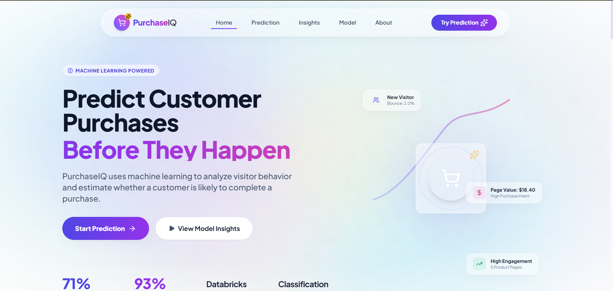

# PurchaseIQ - Real-Time Shopper Purchase Prediction

<p align="center">
  
</p>

<p align="center">
  <strong>AI-powered real-time shopper purchase prediction using Databricks Model Serving.</strong>
</p>

<p align="center">
  <a href="https://purchaseiq.netlify.app/" target="_blank">
    
  </a>
</p>

---

## Overview

PurchaseIQ is an AI-powered web application that predicts whether an online shopper is likely to complete a purchase based on their browsing behavior. It performs client-side feature engineering, one-hot encoding, and sends the processed data to a deployed Databricks Model Serving endpoint for real-time inference.

### Key Highlights

* Real-time AI predictions
* Interactive analytics dashboard
* Client-side feature engineering
* Secure serverless API proxy
* Responsive modern UI
* Probability gauge and prediction insights

---

## Features

* Interactive dashboard for shopper session inputs
* Real-time feature engineering preview
* Live purchase probability prediction
* Circular probability gauge with prediction insights
* Confetti animation for high purchase probability
* Developer logs to inspect request and response payloads
* Fully responsive modern UI
* Secure serverless proxy for Databricks authentication

---

## Tech Stack

| Category      | Technologies                |
| ------------- | --------------------------- |
| Frontend      | React 19, TypeScript, Vite  |
| Styling       | Tailwind CSS, Framer Motion |
| Forms         | React Hook Form, Zod        |
| API           | Axios                       |
| Notifications | Sonner                      |
| Model Serving | Databricks Model Serving    |

---

# How It Works

1. User enters browsing session information.
2. The application calculates additional engineered features.
3. Categorical values are converted into one-hot encoded features.
4. The processed data is sent to a Databricks Model Serving endpoint.
5. The prediction probability is displayed instantly.

---

## Client-Side Feature Engineering

The application automatically computes the following features before inference:

| Feature           | Formula                                         |
| ----------------- | ----------------------------------------------- |
| TotalPages        | Administrative + Informational + ProductRelated |
| TotalDuration     | Sum of all page durations                       |
| ProductFocusRatio | ProductRelated / TotalPages                     |
| ProductTimeRatio  | ProductRelated_Duration / ProductRelated        |
| ExitBounceDiff    | ExitRates − BounceRates                         |

---

## Category Encoding

### Month

One-hot encoded into:

* Month_Aug
* Month_Dec
* Month_Feb
* Month_Jul
* Month_June
* Month_Mar
* Month_May
* Month_Nov
* Month_Oct
* Month_Sep

### Visitor Type

* VisitorType_New_Visitor
* VisitorType_Returning_Visitor
* VisitorType_Other

### Weekend

* true → 1
* false → 0

---

## Security

The application never exposes the Databricks API token to the browser.

Instead:

* Client sends requests to `/api/predict`
* Serverless function injects the Databricks token
* Request is forwarded securely to Databricks
* API credentials remain hidden

Supports both:

* Vercel Serverless Functions
* Netlify Functions

---

# Local Installation

### Clone the repository

```bash
git clone <repository-url>
cd PurchaseIQ
```

### Install dependencies

```bash
npm install
```

### Create a `.env` file

```env
VITE_DATABRICKS_URL=/api/predict
VITE_DATABRICKS_TOKEN=YOUR_DATABRICKS_TOKEN
```

### Start development server

```bash
npm run dev
```

---

## Build for Production

```bash
npm run build
```

---

## Deployment

---

### Netlify

1. Connect repository
2. Add:

```text
DATABRICKS_TOKEN=<your_token>
```

3. Deploy

---

## Project Structure

```text
PurchaseIQ/
│
├── src/
├── api/
├── netlify/
├── public/
├── .env.example
├── package.json
└── README.md
```

---

## Future Improvements

* Authentication
* Prediction history
* Analytics dashboard
* Explainable AI (SHAP)
* Batch prediction
* Dark/Light theme

---

## License

This project is intended for educational and portfolio purposes.
